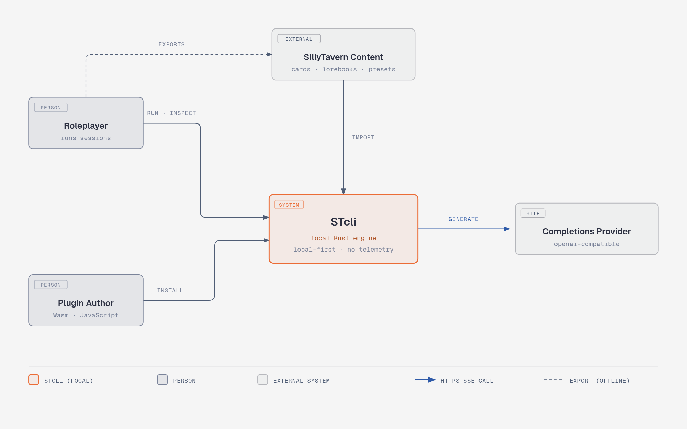

# Architecture

> **Audience**: Engineers contributing code to STcli.
> **Goal**: Understand the system well enough to modify it confidently.
> **Prerequisite**: Read [`CONTEXT.md`](CONTEXT.md) for canonical domain terminology.

## Overview

STcli is a local-first, [SillyTavern](https://github.com/SillyTavern/SillyTavern)-compatible roleplay engine (see the [SillyTavern Parity Matrix](docs/sillytavern-parity.md)). The engine is the `stcli-core` library; `stcli-cli` is a scriptable debug CLI over it. It runs branchable roleplay sessions from SillyTavern-compatible content (character cards, lorebooks, prompt presets). It stores everything in a single SQLite database, sends network requests only to a user-configured HTTPS provider, and has no telemetry.

For the project overview and quick start, see the [root README](README.md). For the full documentation map, see [`docs/README.md`](docs/README.md).

The compatibility target is the bounded `sillytavern-1.18-core` profile, pinned to a specific SillyTavern 1.18.0 commit. STcli does not claim universal SillyTavern compatibility — every feature is classified as **Exact**, **Preserved Metadata**, **Documented Fallback**, or **Hard Unsupported**.

## System context



<!-- Editable source: docs/diagrams/system-context.html — re-export the PNG with headless Chromium after edits. -->

## Container diagram


<!-- Editable source: docs/diagrams/container-diagram.html — re-export the PNG with headless Chromium after edits. -->

## Component diagram — stcli-core


<!-- Editable source: docs/diagrams/component-diagram.html — re-export the PNG with headless Chromium after edits. -->

## Workspace layout

```text
Cargo.toml                    Workspace root (edition 2024, MSRV 1.89)
crates/
  stcli-core/                 Engine library — all domain logic lives here
  stcli-cli/                  CLI binary (stcli) — thin layer over stcli-core
compat/
  profiles/                   Pinned compatibility profile JSON
  fixtures/                   Deterministic fixture suites for parity testing
schemas/                      Versioned public JSON Schemas (CLI envelope, events, capsules)
examples/                     Starter character card, lorebook, and preset artifacts
docs/adr/                     Architecture Decision Records
CONTEXT.md                    Domain terminology dictionary
PRD.md                        Accepted scope, requirements, and roadmap
```

### `stcli-core` vs `stcli-cli`

All domain logic, storage, prompt construction, provider communication, and state management live in **`stcli-core`**. The CLI and TUI are thin adapters: mutations call `StcliEngine::execute`, inspections call `StcliEngine::inspect`, and only the engine orchestrates `Store`. This separation keeps the Turn Trace authoritative and lets frontends share one typed command/event seam.

`stcli-cli` also contains a deterministic HTTPS mock server (`provider_test`) built on `axum` for integration testing.

## Module index

All modules live in `crates/stcli-core/src/`. The public API is re-exported from [`lib.rs`](crates/stcli-core/src/lib.rs). See the component diagram above for descriptions and relationships.

| Module | Source |
|---|---|
| Identity | [`identity.rs`](crates/stcli-core/src/identity.rs) |
| Paths | [`paths.rs`](crates/stcli-core/src/paths.rs) |
| Storage | [`storage.rs`](crates/stcli-core/src/storage.rs) |
| Artifact Codecs | [`artifact.rs`](crates/stcli-core/src/artifact.rs) |
| Session Manager | [`session.rs`](crates/stcli-core/src/session.rs) |
| State Store | [`state.rs`](crates/stcli-core/src/state.rs) |
| Macro Engine | [`macros.rs`](crates/stcli-core/src/macros.rs) |
| Regex Sandbox | [`ecma_regex.rs`](crates/stcli-core/src/ecma_regex.rs) |
| Lore Engine | [`lore.rs`](crates/stcli-core/src/lore.rs) |
| Tokenizer Registry | [`tokenizer.rs`](crates/stcli-core/src/tokenizer.rs) |
| Prompt Manager | [`prompt.rs`](crates/stcli-core/src/prompt.rs) |
| Text Completion Formatter | [`text_completion.rs`](crates/stcli-core/src/text_completion.rs) |
| Provider Client | [`provider.rs`](crates/stcli-core/src/provider.rs) |
| Plugin Host | [`plugin.rs`](crates/stcli-core/src/plugin.rs) |
| Script Runtime | [`script.rs`](crates/stcli-core/src/script.rs) |
| Turn Orchestrator | [`turn.rs`](crates/stcli-core/src/turn.rs) |
| Capsule System | [`capsule.rs`](crates/stcli-core/src/capsule.rs) |
| Compatibility Profile | [`profile.rs`](crates/stcli-core/src/profile.rs) |
| Fixture Runner | [`fixture.rs`](crates/stcli-core/src/fixture.rs) |
| CLI Protocol | [`protocol.rs`](crates/stcli-core/src/protocol.rs) |

## Data model

### SQLite schema (v10)

The database lives at `$STCLI_HOME/data/stcli.sqlite3` (or XDG equivalent) and runs in WAL mode with foreign keys enabled.

```text
schema_migrations       Migration version tracking
trace_events            Append-only authoritative event log (event sourcing)
content_blobs           Content-addressed artifact storage
content_refs            Reference counting for blob GC
artifact_revisions      Artifact metadata indexed by content hash
assets                  Media asset index (avatars and CHARX files)
asset_refs              Reference counting for external asset files
sessions                Session projection
branches                Branch projection
session_configurations  Immutable configuration revisions
turns                   Turn projection
attempts                Generation attempt projection
candidates              Candidate projection
state_cells             Variable state projection (local/global)
```

Media assets are not stored in SQLite. The `assets` and `asset_refs` tables track files under `data/assets/sha256/`. See [ADR 0007](docs/adr/0007-external-content-addressed-asset-storage.md).

### Entity identity

Every entity uses a ULID (`EntityId`) for monotonic sortability. Content is addressed by domain-separated SHA-256 hashes (`ContentHash`). Domain strings prevent cross-type hash collisions:

- `stcli:artifact-revision:v1`
- `stcli:session-configuration:v1`
- `stcli:provider-request:v1`
- `stcli:trace-payload:v1`
- `stcli:turn-capsule:v1`

All canonical hashing uses RFC 8785 (JSON Canonicalization Scheme) via `serde_jcs`.

## Turn lifecycle

This is the central data flow. Understanding it is essential for working on the engine.


<!-- Editable source: docs/diagrams/turn-lifecycle.html — re-export the PNG with headless Chromium after edits. -->

**Dry Run** executes the top half only (through "Build canonical provider request") — no trace events, no provider call, no state commit. This is safe for preview and debugging.

**Crash recovery**: On startup, `recover_interrupted_attempts` finds any attempts stuck in `running` and marks them `incomplete` with a trace event.

### Turn preparation and preset resolution

Both Dry Run and live Generation Attempts go through a unified preparation path in [`Store::prepare_turn`](crates/stcli-core/src/turn.rs):

1. **Effective Generation Settings**: Resolves settings with three-way precedence (Session overrides > Preset defaults > Profile fallbacks) and tracks provenance (`session`, `preset`, or `profile`) in [`EffectiveGenerationSettings`](crates/stcli-core/src/turn.rs). Assembly-only settings (`squash_system_messages`, `use_sysprompt`, `assistant_prefill`, `continue_prefill`, `openai_max_context`) are isolated from provider payloads.
2. **Order profile & slot mapping**: Selects Chat Completion order profile `100001` over `100000`, suppresses disabled native markers, and ensures live user input is included via `chatHistory` or `userInput` exactly once.
3. **Sequential macro dataflow & in-chat injections**: Prompts are rendered in preset order so variable mutations (`setvar`) in early prompts are observable in subsequent prompts. In-chat prompts are spliced relative to dynamic history depth, and empty-rendered prompts preserve side effects without sending empty messages.
4. **Assembly behaviors**: Consecutive system messages are squashed when `squash_system_messages` is active, `use_sysprompt` gates the main prompt, and trailing assistant/continuation prefills are appended.
5. **Safety diagnostics**: Embedded regex scripts and third-party prompt directives (e.g. NemoPresetExt comments) are indexed without execution and emit non-blocking [`CompatibilityWarning`](crates/stcli-core/src/turn.rs) records.

6. **Output formatting**: The provider client formats the assembled prompt for the target endpoint. Chat Completion sends role-tagged messages. Text Completion joins the segments into one flat string with instruct sequences and a story block (`text_completion.rs`). The provider profile `format_mode` field selects the path.

See [`docs/presets.md`](docs/presets.md) for full details on preset semantics and field classifications. See [`docs/text-completion.md`](docs/text-completion.md) for the Text Completion format.

## Plugin system

Plugins are capability-limited Wasm modules that contribute declarative behavior to the engine without directly mutating engine state. Plugins must be pure so that sessions remain deterministically replayable offline.

### Plugin packaging

A plugin is an unpacked directory containing:

```text
my-plugin/
  manifest.json       Declares ID, version, engine range, runtime, component
                       path, component SHA-256, dependencies, SPDX license,
                       subscriptions, prompt slots, commands/macros,
                       settings, and requested capabilities
  component.wasm      WebAssembly Component Model binary (runtime: wasm), or
  plugin.js           JavaScript source (runtime: script)
  settings.schema.json  (optional) JSON Schema for plugin settings
```

The `runtime` manifest field selects the runtime. A `wasm` plugin runs in Wasmtime. A `script` plugin runs in a sandboxed QuickJS engine (`script.rs`), gated by the `scripting` build feature. Both runtimes return the same declarative effect types. For the manifest and the script API, see [`docs/plugins.md`](docs/plugins.md).

### Capability model

Plugins are **sandboxed by design**. MVP capabilities are strictly limited to:

| Allowed | Forbidden |
|---|---|
| Observe supported lifecycle events | Network access |
| Register macros and plugin commands | Direct model/provider access |
| Contribute prompt segments to engine-defined closed slots | Filesystem access |
| Read permitted session data | Secret access |
| Write to own-namespace state cells | Subprocess spawning |
| Structured pre-request abort | Native library loading |
| | Arbitrary provider-request mutation |
| | Arbitrary segment mutation |
| | Post-commit state mutation |

Plugins return **declarative, serializable effects** and receive no mutable engine references. This means the engine can record exactly what a plugin did and replay it without re-executing the Wasm component.

### Plugin lifecycle in a Session

1. **Install**: `stcli plugin install <directory>` validates the manifest, verifies the component hash, and stores it locally.
2. **Pin**: A Session Configuration Revision pins exact component digests and capability grants via `ExtensionPin { id, version, component_hash }`. Installing an update never changes existing sessions.
3. **Adopt**: `stcli plugin adopt --session <id> <id>@<digest>` explicitly creates a new configuration revision with the updated plugin.
4. **Execute**: During a turn, plugins are ordered topologically by declared dependencies, with `before`/`after` ordering within slots and plugin ID as tiebreaker. Cycles fail before an attempt starts.
5. **Replay**: Recorded effects are replayed without component execution — the Wasm binary is not loaded during replay.
6. **Disable/Remove**: Plugins can be disabled or removed without affecting past sessions.

### Plugin data flow


<!-- Editable source: docs/diagrams/plugin-data-flow.html — re-export the PNG with headless Chromium after edits. -->

The Plugin Host (`plugin.rs`) runs both runtimes. The Wasmtime path enforces fuel, epoch timeouts, and memory limits. The QuickJS path enforces memory, stack, and step limits. Each run returns an effect receipt that the trace records for replay.

## Key patterns

### Event sourcing (CQRS-like)

- **Write path**: Append typed events to `trace_events`.
- **Read path**: Query projection tables (`turns`, `attempts`, `candidates`, `state_cells`).
- **Rebuild**: `Store::rebuild_session_projections` replays all trace events to reconstruct projections from scratch.

New features that record state **must** go through trace events. Direct projection mutation breaks the rebuild guarantee.

### Copy-on-write state

`StateTransaction` loads baseline state cells into a `BTreeMap` and tracks overlay writes. On dry run, failure, or cancellation, the overlay is discarded. On success, it's atomically committed to `state_cells` within the same SQLite transaction as the attempt completion.

### Secret redaction

API keys and secret headers are referenced by environment variable name, resolved only at request time. The provider client maintains an internal redaction table and scrubs all resolved secrets from error bodies and stream chunks before they reach SQLite, traces, or CLI output. Literal authorization headers are rejected at validation time.

### Sandboxed regex

ECMAScript regex (for World Info matching) runs in a subprocess (`stcli internal regex-worker`) using the `regress` crate. Pattern size is capped at 4 KB, input at 1 MB, execution at 250 ms. This prevents ReDoS from crashing the engine.

## Dependencies that affect design decisions

These dependencies constrain how you write code. For the full dependency list, see `Cargo.toml`.

| Crate | Design constraint |
|---|---|
| `rusqlite` (bundled) | Only persistent store — all state flows through SQLite. No ORM; raw SQL with `params!` macros |
| `tokio` | Async runtime — provider I/O and streaming are async, but `Store` methods are synchronous |
| `reqwest` + `rustls` | No OpenSSL dependency — TLS is pure Rust. Custom CA certs via `rustls` API, not system store |
| `tiktoken-rs` | Token counts must use the explicit tokenizer registry, not approximate string length |
| `regress` | ECMAScript regex runs out-of-process — you cannot call it directly in the engine |
| `serde_jcs` | Any new hash domain must use RFC 8785 canonical JSON, not `serde_json::to_string` |

## Where to add new code

- **New domain logic**: Add to `stcli-core`. If it's a new module, declare it in `lib.rs` and re-export public types.
- **New CLI command**: Add the `clap` variant to the appropriate `*Command` enum in `main.rs`, implement a `name()` match arm, and add the handler in `execute()`. The handler should call into `stcli-core` and format the result as a `CliEnvelope`.
- **New compatibility behavior**: Implement the logic in the relevant `stcli-core` module, add fixtures to `compat/fixtures/`, and update the profile if needed.
- **New state-changing operation**: It **must** append trace events and commit projections atomically. Follow the pattern in `turn.rs`.
- **New artifact format**: Add a codec variant to `artifact.rs`, register the `ArtifactKind`, and handle it in import/export flows.

For build commands and development checks, see the [README](README.md). For the output format reference, see the [usage guide](docs/guide.md#output-formats).

## Architecture Decision Records

Formal ADRs live in [`docs/adr/`](docs/adr/):

| ADR | Decision | Key consequence |
|---|---|---|
| [0001](docs/adr/0001-authoritative-turn-trace.md) | Turn Trace is the single source of truth | All session state tables are rebuildable projections; new state-changing features must append trace events |
| [0002](docs/adr/0002-versioned-compatibility-and-revisions.md) | Bounded compatibility profile + immutable revisions | Parity = 100% fixture pass rate, not byte-identical HTTP; reformatting creates a new artifact revision |
| [0003](docs/adr/0003-pure-wasm-plugins.md) | Plugins limited to pure Wasm declarative effects | Plugins cannot access network, filesystem, or secrets; replay works without component execution |
| [0004](docs/adr/0004-preset-settings-and-transformations.md) | Resolve preset settings without implicitly trusting transformations | Explicit session overrides preset over profile defaults; embedded scripts and directives produce machine-readable warnings without execution |
| [0005](docs/adr/0005-granular-deletion-tombstones.md) | Granular deletion as tombstones plus session compaction | Turn, Candidate, and Branch deletion appends tombstone events; physical compaction reaps only entities with no active descendants |
| [0006](docs/adr/0006-layered-plugins-and-brokered-effects.md) | Layered plugins with a single brokered live-effect boundary | Supersedes 0003 post-MVP; adds QuickJS Plugin Scripts and brokered HTTPS egress/secondary inference |
| [0007](docs/adr/0007-external-content-addressed-asset-storage.md) | External content-addressed filesystem storage for media assets | SQLite store.db remains lightweight and vacuum-friendly; avatars and media are stored in data/assets/sha256/ with SQLite reference tracking |

